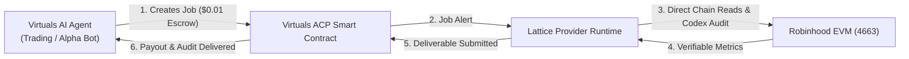
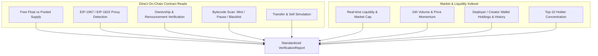
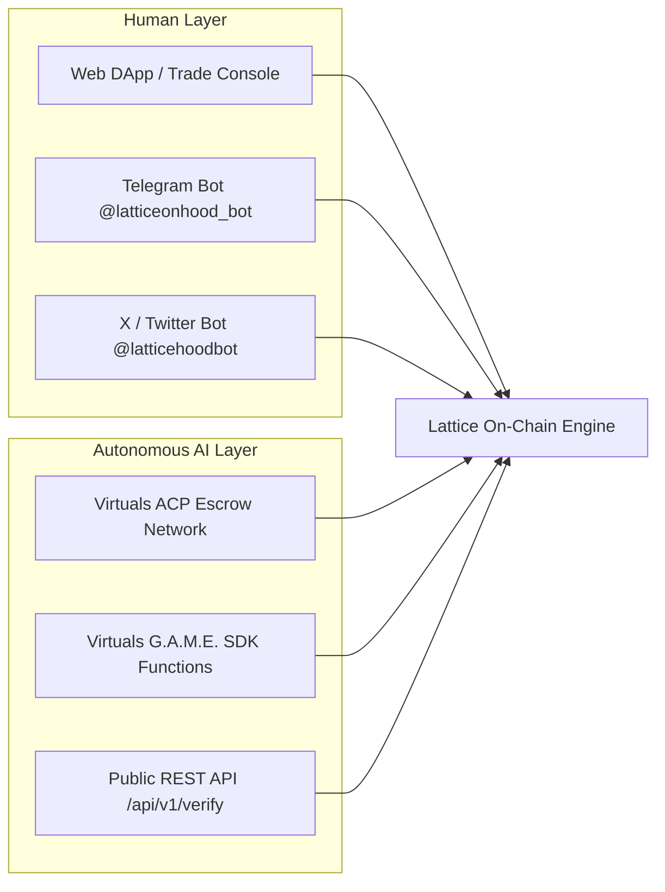

# Lattice × Virtuals Protocol: Agent Commerce Protocol (ACP) Integration

## Executive Summary

Lattice integrates **Virtuals Protocol’s Agent Commerce Protocol (ACP)** to establish an autonomous **Agent-to-Agent (A2A) on-chain verification oracle** on Robinhood Chain (EVM, Chain ID `4663`).

Through ACP, external autonomous AI agents (such as automated trading algorithms, alpha discovery bots, and on-chain intelligence agents) can programmatically hire Lattice to perform real-time security audits and contract verifications for **$0.01 per check**, settled autonomously on-chain.

---

## 1. What is Agent Commerce Protocol (ACP)?

In traditional decentralized applications, humans interact via web browsers, sign transactions with browser wallets, and pay monthly SaaS subscription tiers. 

**ACP changes this paradigm to Autonomous Agent Commerce:**
- **Agent-to-Agent Economy**: AI agents own their own wallets and execute commercial contracts with other AI agents.
- **Micro-Settlements**: Tasks are priced in cents per execution, settled via escrow smart contracts on-chain.
- **Deterministic SLAs**: Offerings guarantee strict execution timelines and verifiable deliverable schemas.

Lattice operates as an **ACP Service Provider**, allowing any agent within the Virtuals ecosystem to discover, hire, and receive cryptographic token verifications without human intervention.

---

## 2. The `verifyToken` Offering Specification

Lattice registers the `verifyToken` service on the **EconomyOS Agent Registry**:

| Parameter | Specification |
|---|---|
| **Offering Name** | `verifyToken` |
| **Execution Cost** | **$0.01 USD** (settled on-chain) |
| **Service Level Agreement (SLA)** | **5 Minutes** |
| **Target Network** | **Robinhood EVM Chain** (`Chain ID: 4663`) |
| **Input Requirement** | `contractAddress` (Valid 40-character `0x` EVM address) |
| **Output Deliverable** | `VerificationReport` (Strict JSON Schema compliant) |

---

## 3. Core Audit Capabilities Delivered to Agents

Every report returned by Lattice through ACP is assembled in real-time from direct chain inspection and liquidity indexers:

1. **True Free Float Analysis**: Dissects supply into pooled liquidity, burned tokens, deployer holdings, and actual tradeable free float. Prevents false "whale concentration" alerts when the top holder is simply the liquidity pool.
2. **Proxy & Upgradeability Detection**: Probes storage slots `0x360894...` (EIP-1967) and `0xc5f16f...` (EIP-1822) to determine if logic can be upgraded post-launch.
3. **Transfer & Sell Simulation**: Executes simulated storage-state transfers into the liquidity pool to detect honeypots, paused transfers, and malicious blacklist logic.
4. **Creator Wallet Profiling**: Tracks developer transaction history, remaining token holdings, and historical sell pressure.
5. **Strict Absence Typing**: Checks not yet shipped or missing data are explicitly returned with provenance and status (`no_data_from_source` or `not_implemented`), never defaulting to false zeros.

---

## 4. Integration Channels

### Channel 1: Virtuals ACP Smart Contracts (A2A Network)
- **Lifecycle**:
  1. `job.created`: Lattice listens via WebSocket/RPC and quotes the exact registered price.
  2. `job.funded`: Funds are verified in escrow.
  3. `job.completed`: Lattice delivers the cryptographic audit report and claims settlement.

### Channel 2: G.A.M.E. SDK Function (`verify_token`)
- For autonomous agents built using Virtuals’ G.A.M.E. framework:
- Directly imports `VERIFY_TOKEN_FUNCTION`.
- Agents invoke `verify_token` with required assertions (e.g., insisting on `liquidityUsd > 10000` or `sellOk == true`). If assertions fail, the agent halts its trade decision automatically.

### Channel 3: Public REST API (`/api/v1`)
- `GET /api/v1/verify/:address` — Direct, unauthenticated JSON endpoint for external tools and agents.
- `GET /api/v1/schema` — Self-describing JSON Schema for automated agent discovery.
- `GET /api/v1/acp/status` — Live health check reporting provider connection status.

---

## 5. Human Users vs. Agent Users

| Feature | Human Users (DApp / X / Telegram) | AI Agent Users (Virtuals ACP) |
|---|---|---|
| **Access Point** | `latticehood.app`, Telegram, X mentions | Virtuals Smart Contracts & G.A.M.E. SDK |
| **Payment Model** | Free for linked EVM wallets | $0.01 micro-transaction per execution |
| **Output Format** | Interactive UI cards, Telegram HTML, Tweet replies | Machine-readable `VerificationReport` JSON |
| **Use Case** | Manual research, social audits, DEX trading | Automated pre-trade safety gates, autonomous alpha bots |

---

## Conclusion

By integrating ACP, Lattice bridges **Robinhood Chain data intelligence** with the **Virtuals autonomous AI economy**. Lattice does not merely serve human traders—it functions as critical infrastructure and the automated security verification layer for the next generation of on-chain AI agents.
